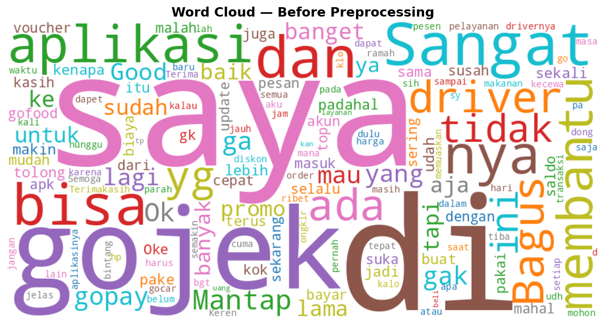
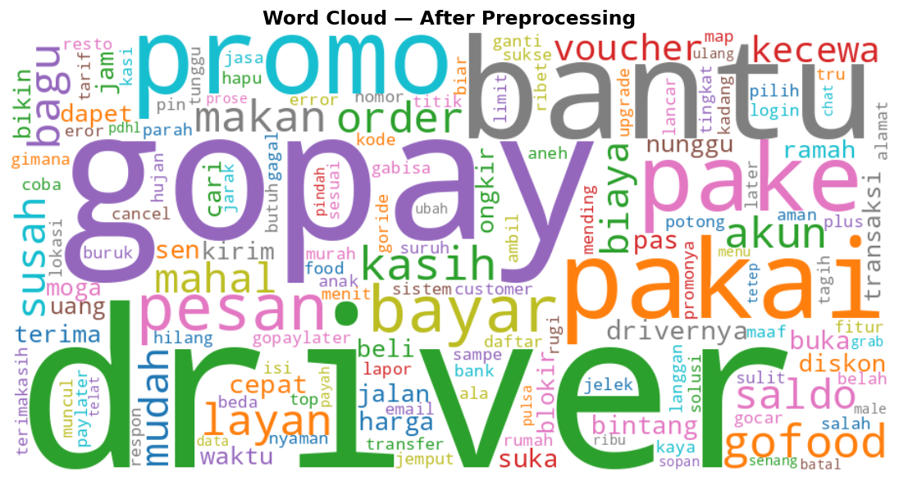
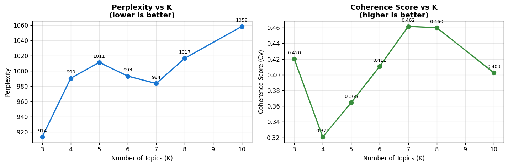
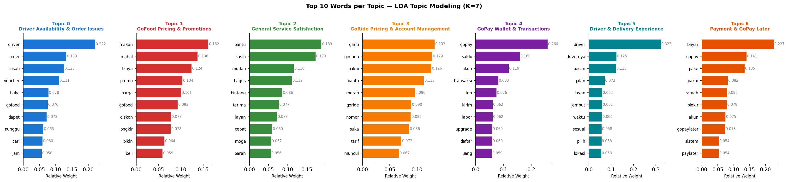
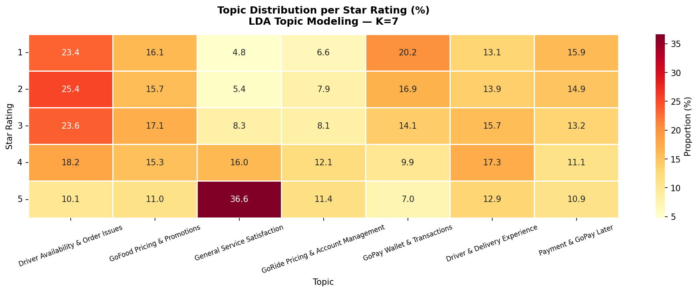
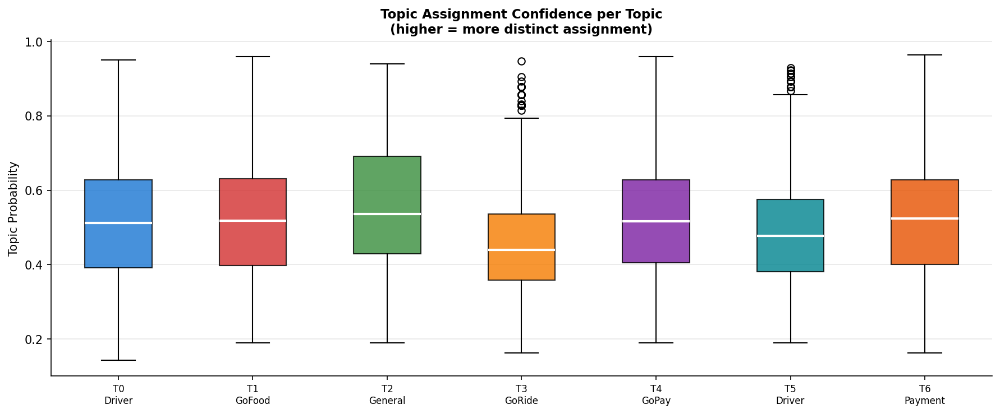

# Gojek App Reviews — Topic Modeling with LDA

Unsupervised topic modeling pipeline applied to 225,000 Indonesian-language Gojek app reviews (Google Play Store, v4.0.0–v4.9.3). Uses Latent Dirichlet Allocation (LDA) with coherence-score-based topic selection to identify seven semantically distinct user concern areas.

---

## Results at a Glance

| Topic | Label | Share | Key Signal |
|:-----:|-------|:-----:|------------|
| T0 | Driver Availability & Order Issues | 18.3% | Dominates 1-star reviews (23.4%) |
| T1 | GoFood Pricing & Promotions | 14.2% | Distributed evenly across all ratings |
| T2 | General Service Satisfaction | 17.7% | Accounts for 36.6% of 5-star reviews |
| T3 | GoRide Pricing & Account Management | 9.0% | Most heterogeneous topic |
| T4 | GoPay Wallet & Transactions | 13.9% | Second-highest in 1-star reviews (20.2%) |
| T5 | Driver & Delivery Experience | 13.6% | Semantically adjacent to T0 |
| T6 | Payment & GoPay Later | 13.5% | Distinct from T4 despite shared vocabulary |

---

## Repository Structure

```
gojek-reviews-topic-modeling/
├── GojekAppReviewV4.0.0-V4.9.3_Cleaned.csv   # Dataset (225,000 reviews)
├── gojek-reviews-topic-modeling.ipynb        # Main analysis notebook
├── whitepaper_gojek_lda.pdf                  # Full technical report
├── figures/
│   ├── fig_wordcloud_raw.png                  # Word cloud before preprocessing
│   ├── fig_wordcloud_clean.png                # Word cloud after preprocessing
│   ├── fig_rating_distribution.png            # Rating distribution (J-shaped)
│   ├── fig_k_selection.png                    # Coherence score vs K
│   ├── fig_topic_words.png                    # Top 10 words per topic
│   ├── fig_topic_wordclouds.png               # Word cloud per topic
│   ├── fig_topic_distribution.png             # Document distribution per topic
│   ├── fig_topic_rating_heatmap.png           # Topic × rating heatmap
│   ├── count_distribution.png                 # Character & word count distribution
│   └── fig_topic_probability.png              # Topic assignment confidence
└── README.md
```

---

## Dataset

**Source:** [Gojek App Reviews Bahasa Indonesia — Kaggle](https://www.kaggle.com/datasets/ucupsedaya/gojek-app-reviews-bahasa-indonesia)

| Attribute | Type | Description |
|-----------|------|-------------|
| `userName` | String | Reviewer display name |
| `content` | String | Review text — primary analysis variable |
| `score` | Integer (1–5) | Star rating |
| `at` | Datetime | Review timestamp |
| `appVersion` | String | App version at time of review |

- **Total reviews:** 225,000
- **After preprocessing:** 90,365 retained (40.2%)
- **Modeling sample:** 30,000 (rating distribution mirrors full corpus, r² = 0.99)
- **Avg. review length:** 8.5 words

---

## Pipeline

```
Raw Data (225,000 reviews)
        │
        ▼
┌─────────────────────────────────┐
│         PREPROCESSING           │
│  1. Lowercase, remove URLs      │
│  2. Remove digits & symbols     │
│  3. Remove tokens < 3 chars     │
│  4. Stopword removal            │
│     Sastrawi + custom (888)     │
│  5. Stemming (Sastrawi)         │
│  6. Post-stem stopword removal  │
└─────────────────────────────────┘
        │ 90,365 reviews retained
        ▼
┌─────────────────────────────────┐
│       DOCUMENT-TERM MATRIX      │
│  CountVectorizer                │
│  max_df=0.90, min_df=10         │
│  max_features=3,000             │
│  ngram_range=(1,2)              │
│  Shape: 30,000 × 3,000          │
└─────────────────────────────────┘
        │
        ▼
┌─────────────────────────────────┐
│       K SELECTION               │
│  Coherence Score (Cv) — primary │
│  Perplexity — convergence check │
│  K ∈ {3,4,5,6,7,8,10}          │
│  K=6 vs K=7 qualitative check   │
│  → K=7 selected (Cv = 0.462)    │
└─────────────────────────────────┘
        │
        ▼
┌─────────────────────────────────┐
│         LDA MODEL               │
│  n_components=7                 │
│  learning_method='online'       │
│  learning_decay=0.7             │
│  max_iter=30                    │
│  random_state=42                │
└─────────────────────────────────┘
        │
        ▼
    7 Topics Identified
```

---

## Key Design Decisions

**Why K=7 and not K=5?**
The original analysis selected K=5 using perplexity alone. Perplexity in scikit-learn's online variational Bayes implementation increases monotonically with K and is not reliable for topic number selection. This project uses Coherence Score (C_v) as the primary criterion, which peaked at K=7 (0.462). A qualitative comparison between K=6 and K=7 confirmed that K=7 produces more operationally meaningful separation — notably between GoPay Wallet (T4) and GoPay Later (T6), and between driver availability issues (T0) and in-trip delivery experience (T5).

**Why not use the full 90,365 reviews?**
Full-corpus LDA training at 3,000-feature vocabulary is computationally prohibitive. The 30,000-review sample was verified to mirror the full corpus rating distribution (r² = 0.99), confirming representativeness.

**Why preserve words like "mahal", "blokir", "cepat" in the stopword list?**
These descriptive words carry domain-specific meaning relevant to topic differentiation. An earlier version of the custom stopword list removed them, which caused over-aggressive filtering and loss of discriminative signal. The final list targets only filler words, informal particles, and app-brand tokens.

---

## Visualizations

**Preprocessing: Before vs. After**

| Before | After |
|--------|-------|
|  |  |

**K Selection — Coherence Score vs K**



Coherence score peaked at K=7 (Cv=0.462). Perplexity is shown for convergence verification only.

**Topic Words**



**Topic × Rating Heatmap**



**Topic Assignment Confidence**



T3 (GoRide) shows the lowest median assignment probability (0.440), reflecting its broader thematic scope — GoRide users frequently co-reference pricing and account issues in the same review.

---

## Installation

```bash
pip install PySastrawi wordcloud gensim scikit-learn pandas numpy matplotlib seaborn tqdm
```

**Python version:** 3.8+

All code is in a single Jupyter notebook. No additional configuration required — the dataset is included in the repository.

---

## Reproducibility

All random states are fixed at `SEED = 42`. The notebook is structured to run top-to-bottom without modification. The only external dependency is the dataset file (`GojekAppReviewV4.0.0-V4.9.3_Cleaned.csv`), which is included in this repository.

---

## References

1. D. M. Blei, A. Y. Ng, and M. I. Jordan, "Latent Dirichlet Allocation," *JMLR*, vol. 3, pp. 993–1022, 2003.
2. M. Röder, A. Both, and A. Hinneburg, "Exploring the Space of Topic Coherence Measures," *ACM WSDM*, 2015.
3. M. Hoffman, D. M. Blei, and F. Bach, "Online Learning for Latent Dirichlet Allocation," *NeurIPS*, 2010.
4. F. Pedregosa et al., "Scikit-learn: Machine Learning in Python," *JMLR*, vol. 12, pp. 2825–2830, 2011.
5. A. Tala, "A Study of Stemming Effects on Information Retrieval in Bahasa Indonesia," M.S. thesis, Universiteit van Amsterdam, 2003.

---

## Author

**Ilham Khadafi**
ilhamkhadafi.dkh@gmail.com
[github.com/hamkhadafi](https://github.com/hamkhadafi)
